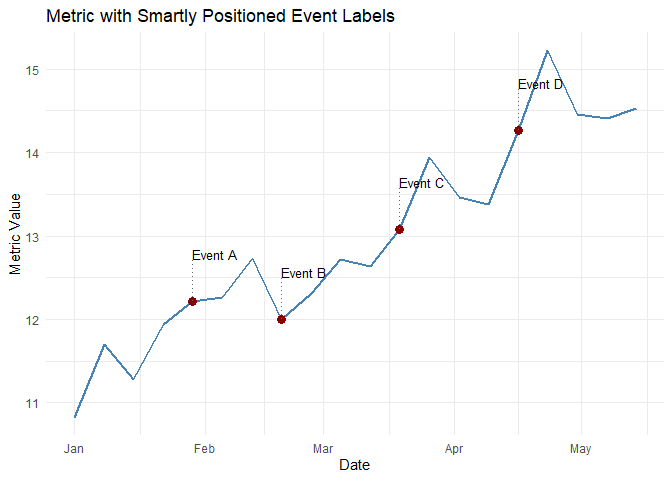

## Problem

You need to create a visual to shows a metric and related events that
influence the trajectory of that metric.

## Solution

#### Load Libraries

This solution uses the `dplyr` and `ggplot2` libraries. The code chunk
below checks for installation and, if needed, will install the libraries
and load them. The `ggplot` library is used to generate the plot at the
end of this example.

#### Create Metric and Event Data

Start by creating data frames that contain the metric values, events and
their corresponding dates. In this example, we are using the `rnorm`
function to generate a random set of metric values, so we set a seed for
reproducibility.

The metric and event data frames are combined into a single data frame.

``` r
set.seed(42)

metric_df <- data.frame(date = seq(as.Date("2023-01-01"), by = "week", length.out = 20),
                        value = cumsum(runif(20, min = -1, max = 1)) + 10)

event_df <- data.frame(date = metric_df$date[c(5, 8, 12, 16)],
                       label = c("Event A", "Event B", "Event C", "Event D"))

event_df <- left_join(event_df, metric_df, by = "date")
```

#### Add Variables for Event Label Placement

We use the following code to determine event label placement; the 80th
percentile of the metric values is used as a threshold to decide label
direction.

We also add the following variables to the data frame before generating
the plot:

-   `direction`: Determines whether the label goes above (1) or below
    (-1) the point, based on the threshold.

-   `offset`: Adjusts label position by ±0.5 units on the Y-axis.

-   `label_y`: Final Y-position of the label.

-   `vjust_val`: Sets vertical justification to anchor the label
    properly based on position (top or bottom).

``` r
threshold <- quantile(metric_df$value, 0.8)

event_df <- event_df %>%
  mutate(direction = ifelse(value > threshold, -1, 1),
         offset = 0.5 * direction,
         label_y = value + offset,
         vjust_val = ifelse(direction == 1, 0, 1))
```

#### Generate Visual

Finally, we generate the combined visual.

``` r
ggplot(metric_df, aes(x = date, y = value)) +
  geom_line(color = "steelblue", linewidth = 1) +
  geom_point(data = event_df, aes(x = date, y = value), color = "darkred", size = 3) +
  geom_segment(data = event_df,
               aes(x = date, xend = date, y = value, yend = label_y),
               linetype = "dotted", color = "gray40") +
  geom_text(data = event_df,
            aes(x = date, y = label_y, label = label, vjust = vjust_val),
            hjust = 0, angle = 0, size = 3.5) +
  labs(title = "Metric with Smartly Positioned Event Labels",
       x = "Date", y = "Metric Value") +
  theme_minimal()
```



## Discussion

This visual is useful when you need to track a metric relative to events
that influence it, e.g. when new product features are being deployed and
we need to understand the impact of feature activation on user adoption.
By plotting the events along the trajectory of the metric, it is easy to
see their influence.
