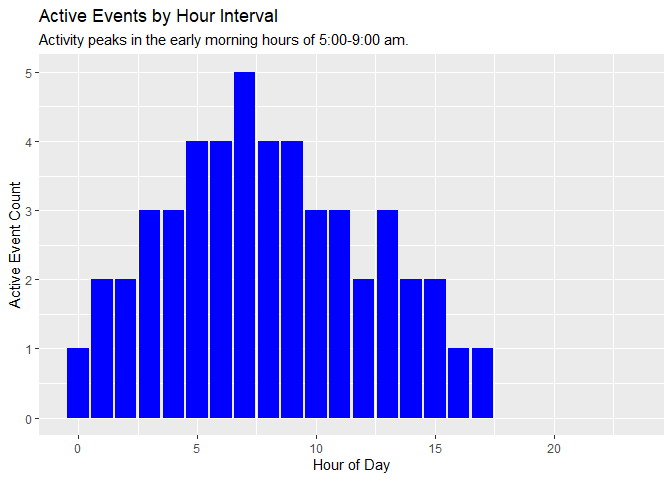

## Problem

You need to count active events by hour interval, accounting for events
that overlap multiple intervals.

## Solution

This solution is implemented as a function that counts active events for
each hour, considering the start and end hours of those events. The
function accounts for events that overlap multiple hour intervals.

This solution assumes events start and end within a single 24-hour day.

#### Load Libraries

This solution uses the `dplyr` and `knitr` libraries. The code chunk
below checks for installation and, if needed, will install the libraries
and load them. The `ggplot` library is used to generate the plot at the
end of this example.

``` r
packages <- c("dplyr", "ggplot2", "knitr")

installed_packages <- packages %in% rownames(installed.packages())

if(any(installed_packages == FALSE)) {
  
  install.packages(packages[!installed_packages])
  
}

invisible(lapply(packages, library, character.only = TRUE))
```

#### Create Example

To demonstrate how to count active events by hour interval, I’ll create
an example data frame.

This data frame has four variables, an event id and integer values for
start hour, end hour and duration, which is calculated by subtracting
the start hour from the end hour.

``` r
events <- data.frame(event_id = c("A", "B", "C", "D", "E", "F", "G", "H", "I"),
                     start_hour = c(0, 1, 2, 3, 4, 5, 6, 7, 13),
                     end_hour = c(1, 3, 5, 7, 9, 11, 13, 15, 17))

events <- events %>%
    mutate(duration = end_hour - start_hour)
```

With the exception of the first event, all the events in this data frame
will overlap at least two intervals, and there will be hours in the day
in which there are no active events. The data frame looks like this.

``` r
kable(events,
      col.names = c("Event", "Start Hour", "End Hour", "Duration"),
      caption = "Events Data Frame",
      format.args = list(big.mark = ","),
      align = c("l", "r", "r", "r"))
```

| Event | Start Hour | End Hour | Duration |
|:------|-----------:|---------:|---------:|
| A     |          0 |        1 |        1 |
| B     |          1 |        3 |        2 |
| C     |          2 |        5 |        3 |
| D     |          3 |        7 |        4 |
| E     |          4 |        9 |        5 |
| F     |          5 |       11 |        6 |
| G     |          6 |       13 |        7 |
| H     |          7 |       15 |        8 |
| I     |         13 |       17 |        4 |

Events Data Frame

#### Count Function

The function below returns the sum of events in which the start hour is
less than or equal to the current hour and the end hour is greater than
or equal to the current hour.

``` r
count_active_events <- function(current_hour, start_hour, end_hour) {
  
  sum(start_hour <= current_hour & end_hour >= current_hour)

}
```

#### Generate Hourly Counts

Use function to create counts table, create an hours vector than
contains integer values for each hour of the day, o through 23.

then create an hourly counts vector with one variable based on the hours
vector. We will use this data frame to capture the counts by interval.

Use the `count_active_events` function to add a second variable to the
data frame, passing the hour of day, start and end hour of each row in
the events data frame.

Note that the `rowwise` function allows you to compute on the events
data frame one row at a time. We use
`this function`rowwise`because the`count_active_events\` function is not
vectorized.

``` r
hours <- 0:23

hourly_counts <- data.frame(hour_of_day = hours)

hourly_counts <- hourly_counts %>%
  rowwise() %>%
  mutate(active_event_count = count_active_events(hour_of_day, events$start_hour, events$end_hour))
```

The following table shows the count of active events by hour.

``` r
kable(hourly_counts,
      col.names = c("Hour", "Active Event Count"),
      caption = "Active Events by Hour Interval",
      format.args = list(big.mark = ","),
      align = c("l", "r"))
```

| Hour | Active Event Count |
|:-----|-------------------:|
| 0    |                  1 |
| 1    |                  2 |
| 2    |                  2 |
| 3    |                  3 |
| 4    |                  3 |
| 5    |                  4 |
| 6    |                  4 |
| 7    |                  5 |
| 8    |                  4 |
| 9    |                  4 |
| 10   |                  3 |
| 11   |                  3 |
| 12   |                  2 |
| 13   |                  3 |
| 14   |                  2 |
| 15   |                  2 |
| 16   |                  1 |
| 17   |                  1 |
| 18   |                  0 |
| 19   |                  0 |
| 20   |                  0 |
| 21   |                  0 |
| 22   |                  0 |
| 23   |                  0 |

Active Events by Hour Interval

## Discussion

This solution is useful when you want to visualize active events over
the course of a day.

``` r
ggplot(hourly_counts, aes(x = hour_of_day, y = active_event_count)) +
  geom_bar(stat = "identity", fill = "blue") +
  labs(title = "Active Events by Hour Interval",
       subtitle = "Activity peaks in the early morning hours of 5:00-9:00 am.",
       x = "Hour of Day",
       y = "Active Event Count")
```


