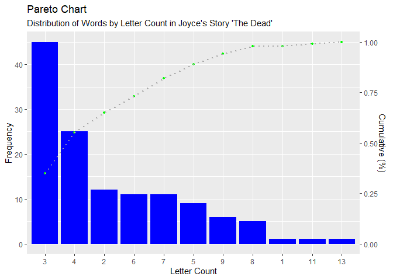

## Problem

You need to generate a frequency distribution table from a series of
values to show the proportion of each value in the data.

## Solution

The code below converts the values into a frequency distribution.

#### Load Libraries

This solution uses the `dplyr`, `knitr` and `stringr` libraries. The
code chunk below checks for installation and, if needed, will install
the libraries and load them. The `ggplot` library is used to generate
the plot at the end of this example.

``` r
packages <- c("dplyr", "ggplot2", "knitr", "stringr")

installed_packages <- packages %in% rownames(installed.packages())

if(any(installed_packages == FALSE)) {
  
  install.packages(packages[!installed_packages])
  
}

invisible(lapply(packages, library, character.only = TRUE))
```

#### Create Words Data Frame

To demonstrate how to create a frequency distribution, I’ll start with a
string of words from a text. I’ll convert the string to a list, remove
punctuation, convert the words to lowercase, coerce the list to data
frame and rename the single column in the data frame.

If you’re curious, this text is taken from the first paragraph of James
Joyce’s short story “The Dead.”

``` r
words <- paste("Lily, the caretaker's daughter, was literally run off her feet. ",
               "Hardly had she brought one gentleman into the little pantry behind ",
               "the office on the ground floor and helped him off with his overcoat ",
               "than the wheezy hall-door bell clanged again and she had to scamper ",
               "along the bare hallway to let in another guest. It was well for her ",
               "she had not to attend to the ladies also. But Miss Kate and Miss ",
               "Julia had thought of that and had converted the bathroom upstairs ",
               "into a ladies' dressing-room. Miss Kate and Miss Julia were there, ",
               "gossiping and laughing and fussing, walking after each other to the ",
               "head of the stairs, peering down over the banisters and calling down ",
               "to Lily to ask her who had come.", sep = "")

words <- unlist(strsplit(words, " "))

words <- gsub("[][,.]", "", words)

words <- str_to_lower(words)

words <- as.data.frame(words, stringsAsFactors = FALSE)

colnames(words) <- c("word")
```

The resulting data frame contains a single ‘word’ column with 127 rows,
one record for each word in the original string. We know there are
duplicates in the data frame, e.g. the word ‘the’, and a frequency
distribution table will enable us to quantify the occurrence of those
duplicates.

#### Additional Data Frame Columns

I’ll add some additional columns to facilitate variations of groups,
e.g. first and last letter columns as well as ‘starts with’ and ‘ends
with’ columns that identify the starting or ending letter as a vowel or
consonant. I also added a letter count for each word.

``` r
words <- words %>%
      mutate(first_letter = str_sub(word, 1, 1),
             last_letter = str_sub(word, str_length(word), str_length(word)),
             letter_count = str_length(word),
             starts_with = ifelse(first_letter %in% c("a", "e", "i", "o", "u"),
                                        "vowel",
                                        "consonant"),
             ends_with = ifelse(last_letter %in% c("a", "e", "i", "o", "u"),
                                "vowel",
                                "consonant"))
```

Here’s a view of the first ten rows of the expanded data frame.

``` r
head(words, 10)
```

    ##           word first_letter last_letter letter_count starts_with ends_with
    ## 1         lily            l           y            4   consonant consonant
    ## 2          the            t           e            3   consonant     vowel
    ## 3  caretaker's            c           s           11   consonant consonant
    ## 4     daughter            d           r            8   consonant consonant
    ## 5          was            w           s            3   consonant consonant
    ## 6    literally            l           y            9   consonant consonant
    ## 7          run            r           n            3   consonant consonant
    ## 8          off            o           f            3       vowel consonant
    ## 9          her            h           r            3   consonant consonant
    ## 10        feet            f           t            4   consonant consonant

#### Letter Count Frequency Distribution

Let’s first generate a frequency distribution based on the letter count
variable.

``` r
count_distribution <- words %>%
    group_by(letter_count) %>%
    summarise(count = n()) %>%
    arrange(dplyr::desc(count)) %>%
    mutate(cumulative_count = cumsum(count),
           frequency = round(count / sum(count), 2),
           cumulative_frequency = round(cumulative_count / sum(count), 2)) %>%
    select(letter_count,
           count,
           frequency,
           cumulative_count,
           cumulative_frequency)
```

Here’s the resulting table.

``` r
kable(count_distribution,
      col.names = c("Letter Count",
                    "Count",
                    "Frequency",
                    "Cumulative Count",
                    "Cumulative Frequency"),
      caption = "Letter Count Frequency Distribution",
      format.args = list(big.mark = ","),
      align = c("l", "r", "r", "r", "r"))
```

| Letter Count | Count | Frequency | Cumulative Count | Cumulative Frequency |
|:-------------|------:|----------:|-----------------:|---------------------:|
| 3            |    45 |      0.35 |               45 |                 0.35 |
| 4            |    25 |      0.20 |               70 |                 0.55 |
| 2            |    12 |      0.09 |               82 |                 0.65 |
| 6            |    11 |      0.09 |               93 |                 0.73 |
| 7            |    11 |      0.09 |              104 |                 0.82 |
| 5            |     9 |      0.07 |              113 |                 0.89 |
| 9            |     6 |      0.05 |              119 |                 0.94 |
| 8            |     5 |      0.04 |              124 |                 0.98 |
| 1            |     1 |      0.01 |              125 |                 0.98 |
| 11           |     1 |      0.01 |              126 |                 0.99 |
| 13           |     1 |      0.01 |              127 |                 1.00 |

Letter Count Frequency Distribution

How do we interpret this table?

Starting with the first row, there are 45 words in the text with a
letter count (or character length) of three, which is 35% of the total
words. There are 25 words in the text with a letter count of four, and
they make up an additional 20% of the total words. Combined, the three-
and four-letter words make up a majority of the words, more
specifically, 55%.

Moving to the end of the table, there is one word with a length of 13.
This word is 1% of the total words.

But what is the distribution of the words themselves?

#### Word Frequency Distribution

Let’s first generate a frequency distribution based on the word
variable.

``` r
word_distribution <- words %>%
    group_by(word) %>%
    summarise(count = n()) %>%
    arrange(dplyr::desc(count)) %>%
    mutate(cumulative_count = cumsum(count),
           frequency = round(count / sum(count), 2),
           cumulative_frequency = round(cumulative_count / sum(count), 2)) %>%
    select(word,
           count,
           frequency,
           cumulative_count,
           cumulative_frequency)
```

This data frame has 84 rows and is considerably longer than the prior
table.

``` r
kable(word_distribution,
      col.names = c("Word",
                    "Count",
                    "Frequency",
                    "Cumulative Count",
                    "Cumulative Frequency"),
      caption = "Word Frequency Distribution",
      format.args = list(big.mark = ","),
      align = c("l", "r", "r", "r", "r"))
```

| Word          | Count | Frequency | Cumulative Count | Cumulative Frequency |
|:--------------|------:|----------:|-----------------:|---------------------:|
| the           |    11 |      0.09 |               11 |                 0.09 |
| and           |     8 |      0.06 |               19 |                 0.15 |
| to            |     7 |      0.06 |               26 |                 0.20 |
| had           |     6 |      0.05 |               32 |                 0.25 |
| miss          |     4 |      0.03 |               36 |                 0.28 |
| her           |     3 |      0.02 |               39 |                 0.31 |
| she           |     3 |      0.02 |               42 |                 0.33 |
| down          |     2 |      0.02 |               44 |                 0.35 |
| into          |     2 |      0.02 |               46 |                 0.36 |
| julia         |     2 |      0.02 |               48 |                 0.38 |
| kate          |     2 |      0.02 |               50 |                 0.39 |
| lily          |     2 |      0.02 |               52 |                 0.41 |
| of            |     2 |      0.02 |               54 |                 0.43 |
| off           |     2 |      0.02 |               56 |                 0.44 |
| was           |     2 |      0.02 |               58 |                 0.46 |
| a             |     1 |      0.01 |               59 |                 0.46 |
| after         |     1 |      0.01 |               60 |                 0.47 |
| again         |     1 |      0.01 |               61 |                 0.48 |
| along         |     1 |      0.01 |               62 |                 0.49 |
| also          |     1 |      0.01 |               63 |                 0.50 |
| another       |     1 |      0.01 |               64 |                 0.50 |
| ask           |     1 |      0.01 |               65 |                 0.51 |
| attend        |     1 |      0.01 |               66 |                 0.52 |
| banisters     |     1 |      0.01 |               67 |                 0.53 |
| bare          |     1 |      0.01 |               68 |                 0.54 |
| bathroom      |     1 |      0.01 |               69 |                 0.54 |
| behind        |     1 |      0.01 |               70 |                 0.55 |
| bell          |     1 |      0.01 |               71 |                 0.56 |
| brought       |     1 |      0.01 |               72 |                 0.57 |
| but           |     1 |      0.01 |               73 |                 0.57 |
| calling       |     1 |      0.01 |               74 |                 0.58 |
| caretaker’s   |     1 |      0.01 |               75 |                 0.59 |
| clanged       |     1 |      0.01 |               76 |                 0.60 |
| come          |     1 |      0.01 |               77 |                 0.61 |
| converted     |     1 |      0.01 |               78 |                 0.61 |
| daughter      |     1 |      0.01 |               79 |                 0.62 |
| dressing-room |     1 |      0.01 |               80 |                 0.63 |
| each          |     1 |      0.01 |               81 |                 0.64 |
| feet          |     1 |      0.01 |               82 |                 0.65 |
| floor         |     1 |      0.01 |               83 |                 0.65 |
| for           |     1 |      0.01 |               84 |                 0.66 |
| fussing       |     1 |      0.01 |               85 |                 0.67 |
| gentleman     |     1 |      0.01 |               86 |                 0.68 |
| gossiping     |     1 |      0.01 |               87 |                 0.69 |
| ground        |     1 |      0.01 |               88 |                 0.69 |
| guest         |     1 |      0.01 |               89 |                 0.70 |
| hall-door     |     1 |      0.01 |               90 |                 0.71 |
| hallway       |     1 |      0.01 |               91 |                 0.72 |
| hardly        |     1 |      0.01 |               92 |                 0.72 |
| head          |     1 |      0.01 |               93 |                 0.73 |
| helped        |     1 |      0.01 |               94 |                 0.74 |
| him           |     1 |      0.01 |               95 |                 0.75 |
| his           |     1 |      0.01 |               96 |                 0.76 |
| in            |     1 |      0.01 |               97 |                 0.76 |
| it            |     1 |      0.01 |               98 |                 0.77 |
| ladies        |     1 |      0.01 |               99 |                 0.78 |
| ladies’       |     1 |      0.01 |              100 |                 0.79 |
| laughing      |     1 |      0.01 |              101 |                 0.80 |
| let           |     1 |      0.01 |              102 |                 0.80 |
| literally     |     1 |      0.01 |              103 |                 0.81 |
| little        |     1 |      0.01 |              104 |                 0.82 |
| not           |     1 |      0.01 |              105 |                 0.83 |
| office        |     1 |      0.01 |              106 |                 0.83 |
| on            |     1 |      0.01 |              107 |                 0.84 |
| one           |     1 |      0.01 |              108 |                 0.85 |
| other         |     1 |      0.01 |              109 |                 0.86 |
| over          |     1 |      0.01 |              110 |                 0.87 |
| overcoat      |     1 |      0.01 |              111 |                 0.87 |
| pantry        |     1 |      0.01 |              112 |                 0.88 |
| peering       |     1 |      0.01 |              113 |                 0.89 |
| run           |     1 |      0.01 |              114 |                 0.90 |
| scamper       |     1 |      0.01 |              115 |                 0.91 |
| stairs        |     1 |      0.01 |              116 |                 0.91 |
| than          |     1 |      0.01 |              117 |                 0.92 |
| that          |     1 |      0.01 |              118 |                 0.93 |
| there         |     1 |      0.01 |              119 |                 0.94 |
| thought       |     1 |      0.01 |              120 |                 0.94 |
| upstairs      |     1 |      0.01 |              121 |                 0.95 |
| walking       |     1 |      0.01 |              122 |                 0.96 |
| well          |     1 |      0.01 |              123 |                 0.97 |
| were          |     1 |      0.01 |              124 |                 0.98 |
| wheezy        |     1 |      0.01 |              125 |                 0.98 |
| who           |     1 |      0.01 |              126 |                 0.99 |
| with          |     1 |      0.01 |              127 |                 1.00 |

Word Frequency Distribution

We can see from this table that the most common word in the text is the
word ‘the,’ which occurs 11 times at a relative frequency of 9%. There
are a large number of words that occur only once in the text, and each
of these have a relative frequency of 1% each.

## Discussion

A frequency distribution table is a way of organizing and summarizing a
set of data to provide a clear and concise representation of its
distribution.

Some related benefits of using a frequency distribution table: \*
Simplifies a large dataset by organizing it into categories or classes
and displaying the frequency (number of occurrences) of each category,
\* Provides a quick overview of the data distribution, allowing you to
identify patterns, tendencies, and central tendencies (such as mode,
median, and mean). \* Facilitates easy comparison between different
categories or classes, helping to identify which values occur more
frequently or less frequently. \* Outliers, or extreme values, can be
easily spotted in a frequency distribution table. This helps in
understanding the presence of unusual data points that might skew the
analysis. \* Serves as a basis for creating visual representations such
as histograms, bar charts, or pie charts, making it easier to
communicate the distribution of data to others.

Here’s an example based on the letter count table we generated.

``` r
scale_right <- tail(count_distribution$cumulative_frequency, n = 1) / head(count_distribution$count, n = 1)

ggplot(count_distribution, ggplot2::aes(x = stats::reorder(letter_count, -frequency))) +
    geom_bar(aes(y = count),
             fill = "blue",
             stat = "identity") +
    geom_point(aes(y = cumulative_frequency / scale_right),
               color = "green",
               pch = 16,
               size = 1) +
    geom_path(aes(y = cumulative_frequency / scale_right, group = 1),
              colour = "darkgrey",
              lty = 3,
              linewidth = 0.9) +
    scale_y_continuous(sec.axis = sec_axis(~.*scale_right, name = "Cumulative (%)")) +
    theme(axis.text.x = element_text(angle = 0, vjust = 0.6)) +
    labs(title = "Pareto Chart",
         subtitle = "Distribution of Words by Letter Count in Joyce's Story 'The Dead'",
         x = "Letter Count",
         y = "Frequency")
```


