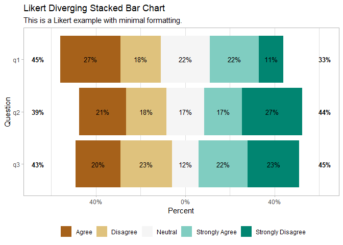
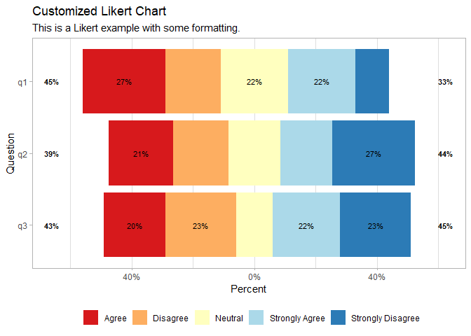

## Problem

When you need to view Likert data using a diverging stacked bar chart.

## Solution

A Likert scale is a psychometric scale named after its inventor,
American social psychologist Rensis Likert, which is commonly used in
research questionnaires. It is the most widely used approach to scaling
responses in survey research.

This solution is based on a five-point Likert scale.

#### Load Libraries

This solution uses the `dplyr`, `ggplot2`, `ggstats` and `knitr`
libraries. The code chunk below checks for installation and, if needed,
will install the libraries and load them.

``` r
packages <- c("dplyr", "ggplot2", "ggstats", "knitr")

installed_packages <- packages %in% rownames(installed.packages())

if(any(installed_packages == FALSE)) {
  
  install.packages(packages[!installed_packages])
  
}

invisible(lapply(packages, library, character.only = TRUE))
```

#### Create Likert Data

Create a data frame, generating one hundred random responses for three
questions using a five-point Likert scale.

``` r
set.seed(91210)

likert_scale <- c("Strongly Agree", 
                  "Agree", 
                  "Neutral", 
                  "Disagree", 
                  "Strongly Disagree")

q1 <- sample(likert_scale, 100, replace = TRUE)

q2 <- sample(likert_scale, 100, replace = TRUE)

q3 <- sample(likert_scale, 100, replace = TRUE)

responses <- data.frame(cbind(q1, q2, q3))
```

Here’s what the data frame looks like.

``` r
head(responses, 10)
```

    ##                   q1                q2                q3
    ## 1              Agree             Agree             Agree
    ## 2              Agree             Agree Strongly Disagree
    ## 3              Agree    Strongly Agree    Strongly Agree
    ## 4           Disagree Strongly Disagree Strongly Disagree
    ## 5              Agree           Neutral    Strongly Agree
    ## 6            Neutral          Disagree Strongly Disagree
    ## 7  Strongly Disagree Strongly Disagree    Strongly Agree
    ## 8  Strongly Disagree             Agree    Strongly Agree
    ## 9  Strongly Disagree             Agree           Neutral
    ## 10             Agree             Agree             Agree

#### Generate Chart

``` r
gglikert(responses) +
    labs(title = "Likert Diverging Stacked Bar Chart",
         subtitle = "This is a Likert example with minimal formatting.",
         x = "Percent",
         y = "Question")
```


\#### Customize Chart

Likert charts generated with `gglikert` can be customized via a range of
arguments as well as functions from the `ggplot2` package that allow for
customization of colors, for example.

``` r
gglikert(responses,
         labels_size = 3,
         labels_accuracy = 1,
         labels_hide_below = .2,
         labels_color = "black") +
    scale_fill_brewer(palette = "RdYlBu") +
    labs(title = "Customized Likert Chart",
         subtitle = "This is a Likert example with some formatting.",
         x = "Percent",
         y = "Question")
```

    ## Scale for fill is already present.
    ## Adding another scale for fill, which will replace the existing scale.



## Discussion

Diverging stacked bar charts are an effective means to visualize survey
data when collected via a Likert scale.
