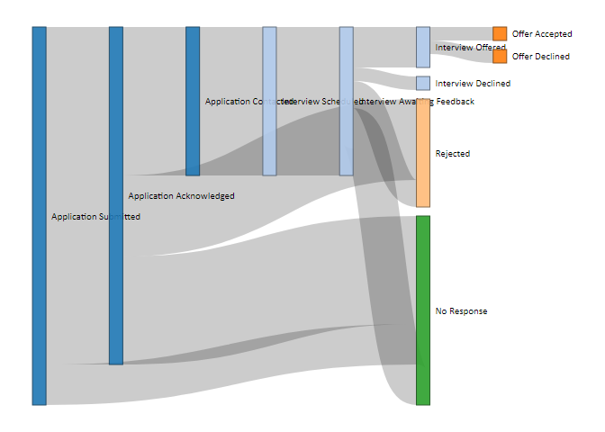

## Problem

You need to visualize the flow of resources or information within a
system.

## Solution

A sankey chart is a type of flow diagram that visualizes the flow of
information within a system through a series of interconnected pathways.

The width of the arrows or lines in a sankey chart is proportional to
the quantity of the flow, allowing for a clear representation of the
relative magnitudes of different components.

These charts are particularly useful for presenting complex systems with
multiple inputs, outputs, and interconnections in a visually intuitive
and easily understandable manner.

#### Load Libraries

This solution uses the `dplyr`,`knitr` and `networkD3` libraries. The
code chunk below checks for installation and, if needed, will install
the libraries and load them.

``` r
packages <- c("dplyr", "knitr", "networkD3")

installed_packages <- packages %in% rownames(installed.packages())

if(any(installed_packages == FALSE)) {
  
  install.packages(packages[!installed_packages])
  
}

invisible(lapply(packages, library, character.only = TRUE))
```

#### Create Sample Data

This example imports sample data intended to represent the flow of
applications through an interview process.

Each node in the dataset is a step (or stage) in that process.
Collectively, the nodes represent the end-to-end process.

``` r
nodes <- read.csv("../inst/extdata/sankey/nodes.txt",
                   header = TRUE,
                   sep = ",",
                   na.strings = c(""),
                   stringsAsFactors = FALSE)

kable(nodes,
      col.names = c("Id", "Name"),
      caption = "Nodes",
      format.args = list(big.mark = ","),
      align = c("l", "l"))
```

| Id  | Name                        |
|:----|:----------------------------|
| 1   | Application Submitted       |
| 2   | Application Acknowledged    |
| 3   | Application Contacted       |
| 4   | Interview Scheduled         |
| 5   | Interview Awaiting Feedback |
| 6   | Interview Offered           |
| 7   | Interview Declined          |
| 8   | Offer Accepted              |
| 9   | Offer Declined              |
| 10  | Rejected                    |
| 11  | No Response                 |

Nodes

In addition, the sample data captures the flow for a specific applicant.
Using this sample data, we can visualize the flow for applications to
ten different positions.

``` r
sample <- read.csv("../inst/extdata/sankey/sample.txt",
                   header = TRUE,
                   sep = ",",
                   na.strings = c(""),
                   stringsAsFactors = FALSE)

kable(head(sample, 10),
      col.names = c("Position", "Starting Status", "Ending Status"),
      caption = "Job Search Process Flow",
      format.args = list(big.mark = ","),
      align = c("l", "l", "l"))
```

| Position   | Starting Status          | Ending Status            |
|:-----------|:-------------------------|:-------------------------|
| Position 1 | Application Submitted    | No Response              |
| Position 2 | Application Submitted    | No Response              |
| Position 3 | Application Submitted    | No Response              |
| Position 1 | Application Submitted    | Application Acknowledged |
| Position 1 | Application Acknowledged | No Response              |
| Position 2 | Application Submitted    | Application Acknowledged |
| Position 2 | Application Acknowledged | No Response              |
| Position 3 | Application Submitted    | Application Acknowledged |
| Position 3 | Application Acknowledged | No Response              |
| Position 4 | Application Submitted    | Application Acknowledged |

Job Search Process Flow

To populate the sankey chart, we need to create a grouped data frame,
showing the count of events, if you will, for each unique combination of
starting and ending steps in the process.

``` r
sample <- sample %>%
  group_by(starting_status,
           ending_status) %>%
  summarise(count = n())
```

    ## `summarise()` has grouped output by 'starting_status'. You can override using
    ## the `.groups` argument.

``` r
kable(sample,
      col.names = c("Starting Status", "Ending Status", "Count"),
      caption = "Job Search Process Flow",
      format.args = list(big.mark = ","),
      align = c("l", "l", "r"))
```

| Starting Status             | Ending Status               | Count |
|:----------------------------|:----------------------------|------:|
| Application Acknowledged    | Application Contacted       |    11 |
| Application Acknowledged    | No Response                 |     8 |
| Application Acknowledged    | Rejected                    |     6 |
| Application Contacted       | Interview Scheduled         |    11 |
| Application Submitted       | Application Acknowledged    |    25 |
| Application Submitted       | No Response                 |     3 |
| Interview Awaiting Feedback | Interview Declined          |     1 |
| Interview Awaiting Feedback | Interview Offered           |     3 |
| Interview Awaiting Feedback | No Response                 |     3 |
| Interview Awaiting Feedback | Rejected                    |     2 |
| Interview Offered           | Offer Accepted              |     1 |
| Interview Offered           | Offer Declined              |     1 |
| Interview Scheduled         | Interview Awaiting Feedback |    11 |

Job Search Process Flow

We then add source and target ids to the data frame. These will be used
in creation of the chart.

``` r
sample$source_id <- match(sample$starting_status, nodes$node_title) - 1
```

``` r
sample$target_id <- match(sample$ending_status, nodes$node_title) - 1
```

Generate the sankey chart using the summarized sample data.

``` r
p <- sankeyNetwork(Links = sample,
                   Nodes = nodes,
                   Source = "source_id",
                   Target = "target_id",
                   Value = "count",
                   NodeID = "node_title",
                   sinksRight = FALSE,
                   iterations = 0,
                   fontFamily = "Calibri",
                   fontSize = 11); p
```

    ## Links is a tbl_df. Converting to a plain data frame.



## Discussion

There are several observations we can make from this visual. First,
there are a high number of applications for which no response is
received, or are rejected without an opportunity for interview. And
second, even when an interview is offered, there is still a high number
of rejections.

To address the first opportunity, it might make sense to evaluate how
well matched a resume is to the position as documented. To address the
second, more interview preparation might be warranted.
